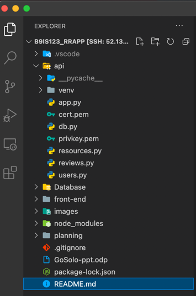
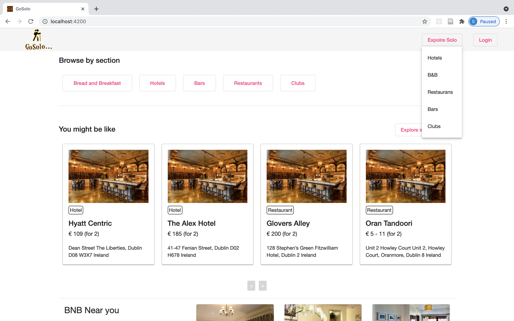
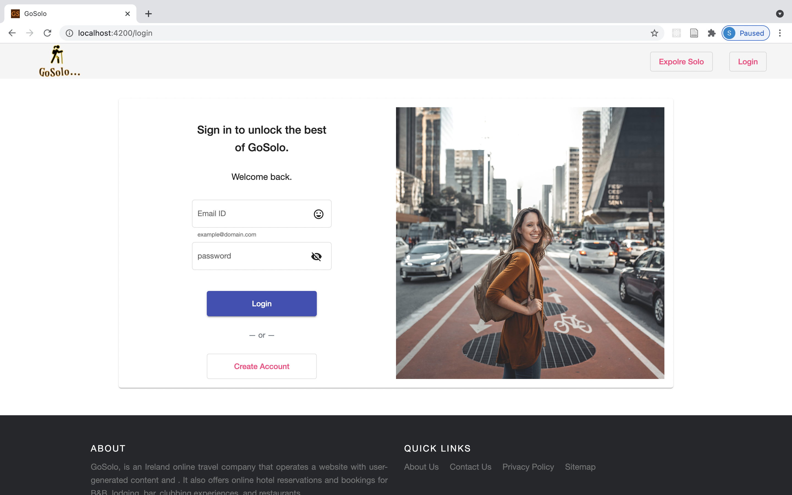
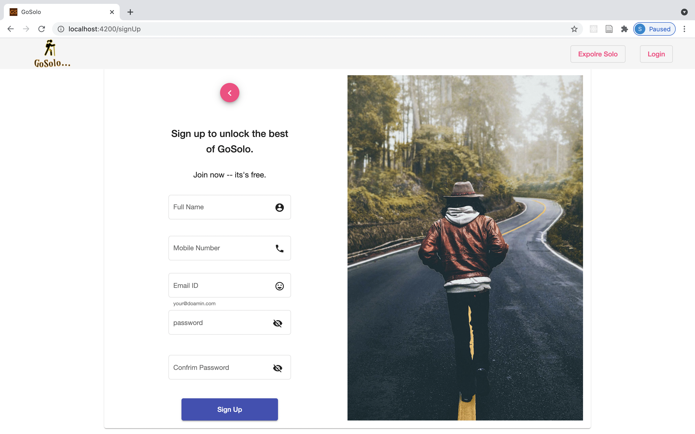
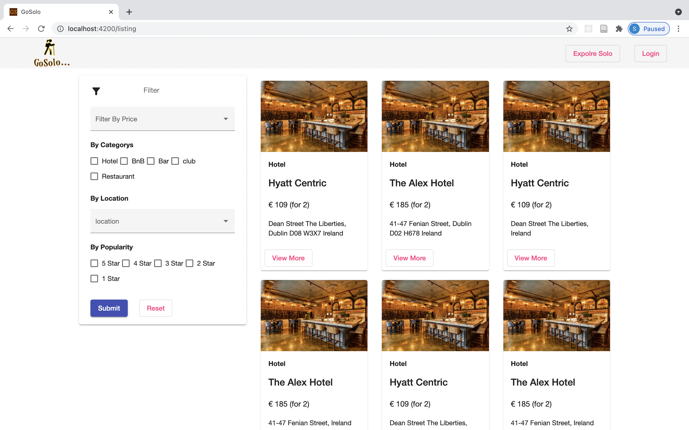
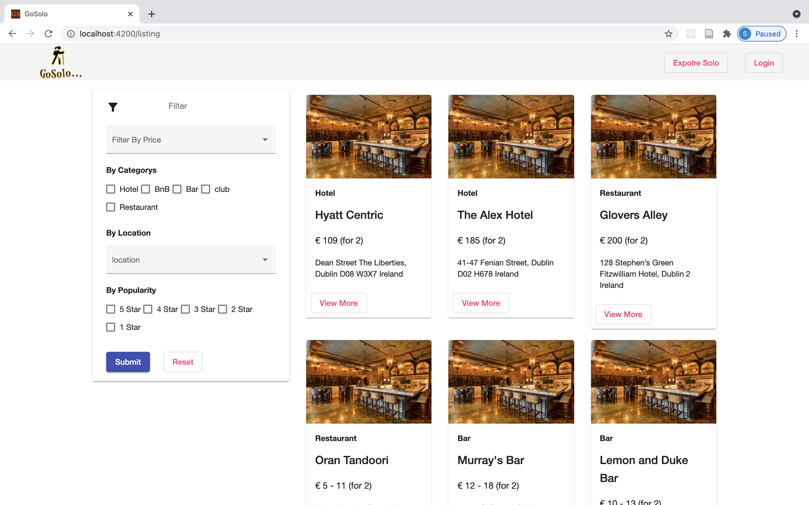
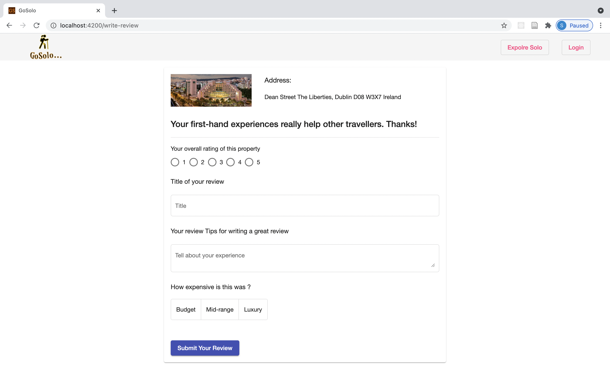
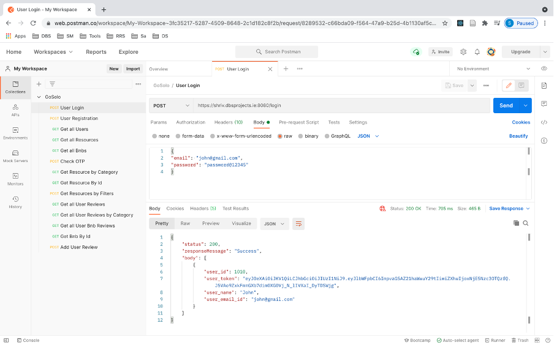

# **B9IS123 Programming for Information Systems – CA2**

**GoSolo - Restaurant Reviews Application**

**Module Leader: Paul Laird**

**Group - B**

**Student Names:**

- **Tushar Chavan (10552610)**

- **Shrivardhan Limbkar (10573876)**

- **Bijendra Gaur (10525552)**

**Project Overview**

**GoSolo** , is an Ireland online travel company that operates a website with user-generated content. It also offers online hotel reservations and bookings for B&amp;B, lodging, bar, clubbing experiences, and restaurants.

**Project Features**

- User Management
  - Login / Registration – OTP based Registration
- Listing Resources &amp; Details Page
  - Resources – Restaurants / Hotel, Bars, Clubs
- Filters - By
  - Price, Categories, Location, Popularities
- User Ratings &amp; Reviews
  - Read / Write reviews
- Booking page

**Technologies Used**

- **Frontend** – Angular9, Material UI, HTML5, CSS3/SCSS, TypeScript, JavaScript
- **Backend** – Python, Flask framework, Restful APIs, JSON
- **Database** – MySQL
- **Hosting** – Azure VM, Linux
- **IDE** – Visual Studio Code, phpMyAdmin, PHP workbench
- **Security** – JWT Token, Secure hash algorithms (hashlib, md5, salt), Email OTP based user registration

**Git Repo**

[https://github.com/shreelimbkar/B9IS123_RRApp](https://github.com/shreelimbkar/B9IS123_RRApp)

**Directory Structure**



**Getting Started**

VM base URL - [https://shriv.dbsprojects.ie:8080](https://shriv.dbsprojects.ie:8080/)

- Run frontend app

- Run APIs

```
cd api
python3 app.py --cert=cert.pem --key=privkey.pem
```

**Application Screenshots:**

- Landing Page
  
  

- User Login
  

- User Registration
  

- List Page
  

- Filters
  

- Image Currausals
  

- User Reviews
  

**Rest APIs Documentations**

**Screenshot**



Postman Public link:[https://www.getpostman.com/collections/fcaec4ce7917c658719e](https://www.getpostman.com/collections/fcaec4ce7917c658719e)

POST User Login

[https://shriv.dbsprojects.ie:8080/login](https://shriv.dbsprojects.ie:8080/login)

POST User Registration

[https://shriv.dbsprojects.ie:8080/users/register](https://shriv.dbsprojects.ie:8080/users/register)

GET Get all User

[https://shriv.dbsprojects.ie:8080/users](https://shriv.dbsprojects.ie:8080/users)

GET Get all Resources

[https://shriv.dbsprojects.ie:8080/resources](https://shriv.dbsprojects.ie:8080/resources)

GET Get all Bnbs

[https://shriv.dbsprojects.ie:8080/resources/allbnbs](https://shriv.dbsprojects.ie:8080/resources/allbnbs)

POST Check OTP

[https://shriv.dbsprojects.ie:8080/users/checkotp](https://shriv.dbsprojects.ie:8080/users/checkotp)

GET Get Resources by Category

[https://shriv.dbsprojects.ie:8080/resources?category=&#39;hotel](https://shriv.dbsprojects.ie:8080/resources?category='hotel)&#39;

GET Get Resources by Id

[https://shriv.dbsprojects.ie:8080/resourcesbyid?id=10](https://shriv.dbsprojects.ie:8080/resourcesbyid?id=10)

POST Filter Resources

[https://shriv.dbsprojects.ie:8080/resources/filters](https://shriv.dbsprojects.ie:8080/resources/filters)

GET Get all User Reviews

[https://shriv.dbsprojects.ie:8080/reviews](https://shriv.dbsprojects.ie:8080/reviews)

GET Get all User Reviews by Categroy

[https://shriv.dbsprojects.ie:8080/reviews?category=2](https://shriv.dbsprojects.ie:8080/reviews?category=2)

GET Get all User Bnb Reviews

[https://shriv.dbsprojects.ie:8080/reviews/bnbs](https://shriv.dbsprojects.ie:8080/reviews/bnbs)

GET Get Bnb by Id

[https://shriv.dbsprojects.ie:8080/resources/allbnbs?id=1](https://shriv.dbsprojects.ie:8080/resources/allbnbs?id=1)

POST Add User review

[https://shriv.dbsprojects.ie:8080/reviews/add](https://shriv.dbsprojects.ie:8080/reviews/add)

**Individual Contribution**

**Tushar** - Planning + Database + API (backend) + Data preparation

**Shrivardhan** - Planning + API (backend) + Database + VM project setup

**Bijendra** - Planning + Frontend + Database + API integration

**Reference**

- O. Ethelbert, F. F. Moghaddam, P. Wieder, and R. Yahyapour, &quot;A JSON Token-Based Authentication and Access Management Schema for Cloud SaaS Applications,&quot; in _2017 IEEE 5th International Conference on Future Internet of Things and Cloud (FiCloud)_, Aug. 2017, pp. 47–53, doi: [10.1109/FiCloud.2017.29](https://doi.org/10.1109/FiCloud.2017.29). [1]
- Bhawiyuga, M. Data, and A. Warda, &quot;Architectural design of token based authentication of MQTT protocol in constrained IoT device,&quot; in _2017 11th International Conference on Telecommunication Systems Services and Applications (TSSA)_, Oct. 2017, pp. 1–4, doi: [10.1109/TSSA.2017.8272933](https://doi.org/10.1109/TSSA.2017.8272933). [2]
- S. K. Kasagoni, _Building Modern Web Applications Using Angular_. Packt Publishing Ltd, 2017.[3]
- M. Delisle, _Creating Your MySQL Database: Practical Design Tips and Techniques_. Packt Publishing Ltd, 2006.[4]
- Severance, &quot;Discovering JavaScript Object Notation,&quot; _Computer_, vol. 45, no. 4, pp. 6–8, Apr. 2012, doi: [10.1109/MC.2012.132](https://doi.org/10.1109/MC.2012.132).[5]
- &quot;hjp: doc: RFC 7523: JSON Web Token (JWT) Profile for OAuth 2.0 Client Authentication and Authorization Grants.&quot; [https://www.hjp.at/doc/rfc/rfc7523.html](https://www.hjp.at/doc/rfc/rfc7523.html) (accessed Apr. 28, 2021).[6]
- S. Suehring, _JavaScript Step by Step_. Pearson Education, 2013.[7]
- M. Lutz, _Learning Python: Powerful Object-Oriented Programming_. O&#39;Reilly Media, Inc., 2013.[8]
- M. Spreitzenbarth and D. J. Uhrmann, _Mastering Python Forensics_. Packt Publishing Ltd, 2015.[9]
- S. Suehring, _MySQL bible_. New York, NY: Wiley Publ, 2002.[10]
- S. J. Nielson and C. K. Monson, _Practical Cryptography in Python: Learning Correct Cryptography by Example_. Apress, 2019.[11]
